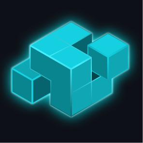

# Juno

## Overview

Juno has evolved into a platform that includes tools and libraries for developing Juno-based applications. This platform provides a comprehensive set of utilities to streamline the development process, ensure consistency, and facilitate code sharing across different projects.

### Key Components

- **Design System**: The `ui-components` library offers a consistent set of UI components, styles, and guidelines for building user interfaces.
- **OIDC Library**: Provides OpenID Connect (OIDC) support for authentication and authorization in Juno-based applications.
- **Communicator Library**: Facilitates communication between different parts of the application, ensuring efficient data exchange.
- **CLI Tools**: Command-line tools to generate, build, and manage applications and libraries, simplifying the development workflow.

### Applications

Juno includes various applications that showcase the use of its tools and libraries, providing examples and templates for developers.

#### Included Applications

- `apps/example`
- `apps/template`

### Libraries

In addition to applications, Juno also includes a set of libraries that provide shared functionality and utilities across different parts of the system. These libraries are designed for reusability and modularity, facilitating consistent development practices and code sharing.

#### Included Libraries

- `packages/ui-components`
- `packages/communicator`
- `packages/oauth`

## Getting Started

To get started with Juno, follow the instructions in the [Getting Started Guide](docs/getting-started.md). This guide covers the initial setup, installation of dependencies, and basic usage of the platform's tools and libraries.

## Documentation

Comprehensive documentation for Juno is available in the [docs](docs) directory. This includes detailed guides on using the various tools and libraries, best practices, and examples to help you get the most out of the platform.

## Support, Feedback, Contributing

This project is open to feature requests/suggestions, bug reports, etc. via [GitHub issues](https://github.com/cloudoperators/juno/issues). Contribution and feedback are encouraged and always welcome. For more information about how to contribute, the project structure, as well as additional contribution information, see our [Contribution Guidelines](CONTRIBUTING.md).

## Code of Conduct

We as members, contributors, and leaders pledge to make participation in our community a harassment-free experience for everyone. By participating in this project, you agree to abide by its [Code of Conduct](https://github.com/SAP/.github/blob/main/CODE_OF_CONDUCT.md) at all times.

## Licensing

Copyright 2024-2026 SAP SE or an SAP affiliate company and Juno contributors. Please see our [LICENSE](LICENSE) for copyright and license information. Detailed information including third-party components and their licensing/copyright information is available [via the REUSE tool](https://api.reuse.software/info/github.com/cloudoperators/juno).
