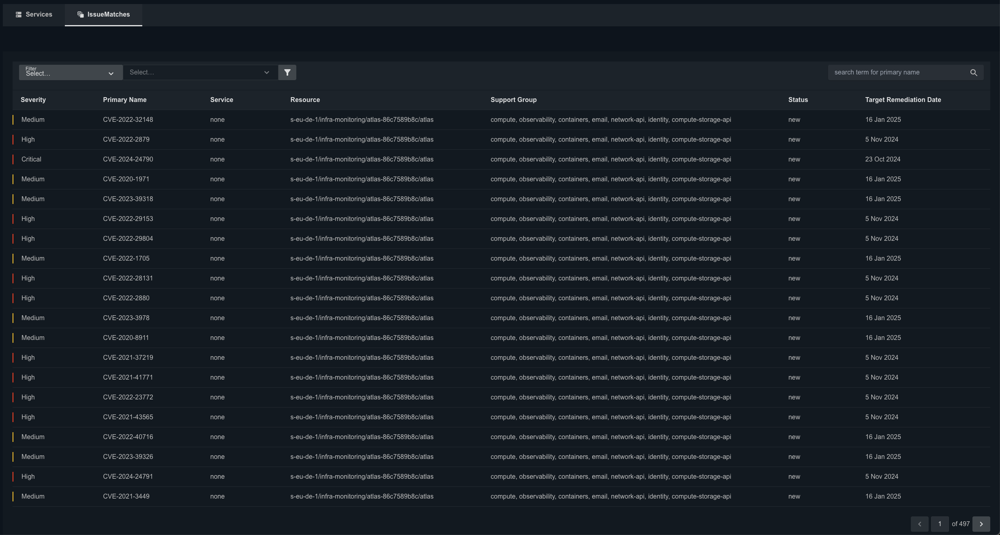
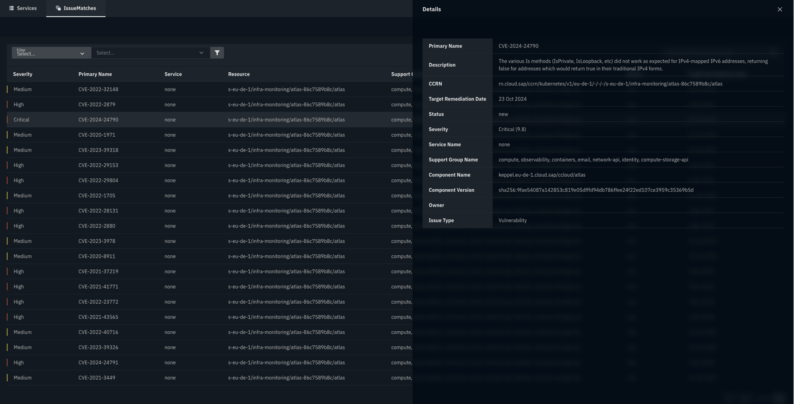
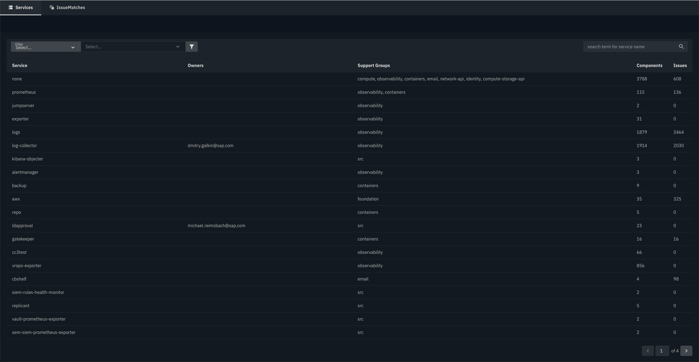
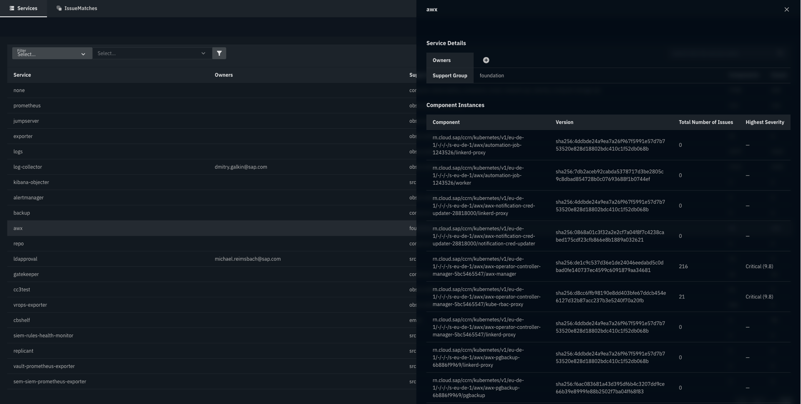

# Heureka

[](LICENSE)
[](https://github.com/cloudoperators/juno)

This standalone UI uses the Heureka POC API which aims to:

- Track the overall state of our technology landscape
- Establish a unified and complete Patch Management Process, including:

  - Maintaining and tracking vulnerabilities and affected components
  - Documenting the remediation, classification, and impact of vulnerabilities
  - Recording changes related to vulnerability patching and component updates

For your more info Heureka is a Security Posture Management tool designed to manage security issues in a cloud operating system.

Its primary focus is remediation management of security issues such as vulnerabilities, security events, and policy violations while ensuring compliance and audit-ability. The BE code for Heureka including its used API here for frontend is available in the following repo: https://github.com/cloudoperators/heureka

## Coming soon

- Configurable initial filters to automatically apply at app startup.
- Pagination for the Component Instances list in the service details panel.

## Screenshots

IssueMatches list view:



IssueMatches detail view:



Services list view:



Services detail view:



## Standalone Mode

To create a static, runnable build, execute the following commands:

```bash
cd apps/heureka
npx turbo build:static
```

This will generate an `index.html` file along with the necessary assets in the dist folder. You’ll need to copy a `appProps.json` file containing the required props into the dist folder.

## As a Micro Frontend (MFE)

To build a library version for dynamic import, use the following commands:

```bash
cd apps/heureka
npx turbo build
```

This will create a build folder with all assets. You can host this folder and load it as an MFE using dynamic import:

```html
<div id="root"></div>

<script type="module">
  import("PATH_TO_HOST/heureka/build/index.js").then((app) => {
    app.mount(document.getElementById("root"), { props: /* PROPS JSON */ })
  })
</script>
```

## Development Mode

First, create an `appProps.json` file in the root directory of the application (apps/heureka), using appProps.template.json as a reference. Customize the file with the necessary properties. Once completed, run the following commands:

```bash
cd apps/heureka
npx turbo dev
```

### Testing

```bash
cd apps/heureka
npx turbo test
```

## App Props

These are the customizable application properties (appProps) that you can define in your appProps.json file:

- **theme** (optional): Overrides the default theme. Acceptable values are `"theme-light"` or `"theme-dark"` (default).
- **apiEndpoint** (required): The URL of the API endpoint the app will interact with.
- **embedded** (optional): Set to `true` if the app will be embedded within another app or page. When `true`, the app will not display the header or footer, rendering only the content. Default is `false`.
