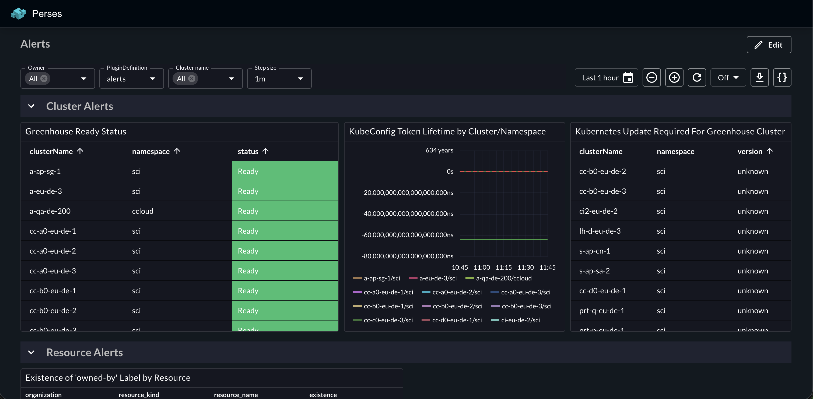
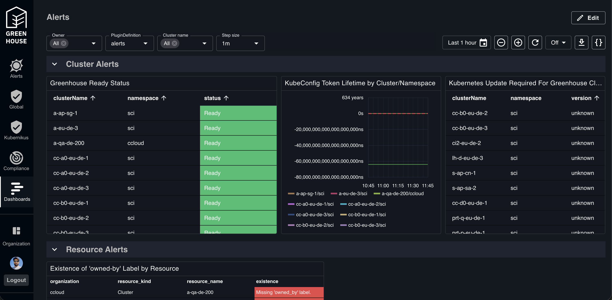

# Perses App

[](LICENSE)

This app demonstrates two things:

1. **How to build an external Juno app** — a self-contained React app that runs inside the [Juno](https://github.com/cloudoperators/juno) / [Greenhouse](https://github.com/cloudoperators/greenhouse) shell, which renders each app inside a shadow DOM.
2. **How to make Emotion and MUI styles work inside a shadow DOM** — by redirecting Emotion's style injection and MUI's portal targets into the component's own DOM subtree rather than `document.head` / `document.body`.

It renders an Alerts dashboard (sourced from the Greenhouse Perses dashboard) using the [`@perses-dev`](https://github.com/perses/perses) library.

---

## Screenshots

**Standalone**



**Inside Greenhouse Shell App**



---

## Shadow DOM style isolation

When a Juno app runs inside Greenhouse, it is mounted inside a shadow root. This breaks two things by default:

- **Emotion injects `<style>` tags into `document.head`**, which is outside the shadow DOM and therefore invisible to elements inside it.
- **MUI portals (`Popover`, `Modal`, `Popper`) render into `document.body`**, which is also outside the shadow DOM and does not receive the scoped styles.

The `Dashboard` component solves both problems:

```
<span ref={setStyleContainer} />   ← Emotion <style> tags go here (inside shadow DOM)
<div ref={setPortalContainer} />   ← MUI Popovers/Modals portal here (inside shadow DOM)
```

- `styleContainer` is passed to `@emotion/cache` as `container`, so all Emotion-generated `<style>` elements are injected into the component's own subtree.
- `portalContainer` is set as the default `container` on `MuiPopover`, `MuiModal`, and `MuiPopper` via the MUI theme's `components.defaultProps`, so portaled elements are also kept inside the shadow DOM.
- `ThemeProvider` is imported from `@mui/material/styles` (not `@emotion/react`) so that MUI's `useDefaultProps` hook sees the component overrides — using Emotion's `ThemeProvider` directly would silently ignore them.

---

## Running locally

### 1. Configure app props

Copy the template and fill in your Prometheus datasource URL:

```bash
cp appProps.template.json appProps.json
```

Edit `appProps.json`:

```json
{
  "endpoint": "https://your-prometheus-url",
  "theme": "theme-dark",
  "embedded": false,
  "basePath": "/",
  "enableHashedRouting": false
}
```

| Field      | Description                                             |
| ---------- | ------------------------------------------------------- |
| `endpoint` | Prometheus datasource URL used by the Perses dashboards |
| `theme`    | `"theme-dark"` or `"theme-light"`                       |
| `embedded` | Set to `true` to hide the app shell chrome              |

### 2. Install dependencies

From the repo root:

```bash
pnpm install
```

### 3. Start the dev server

```bash
pnpm --filter @cloudoperators/juno-app-perses dev
```

Or from within `apps/perses`:

```bash
pnpm dev
```

---

## Project structure

```
apps/perses/
├── src/
│   ├── App.tsx                          # App entry — renders the Alerts dashboard
│   ├── components/
│   │   └── Dashboard.tsx                # Perses ViewDashboard wrapper with shadow DOM fixes
│   ├── resources/
│   │   ├── dashboards/
│   │   │   └── alerts.json              # Alerts dashboard definition (from Greenhouse)
│   │   └── prometheus-datasource.json   # Default datasource config
│   ├── api/
│   │   └── index.ts                     # MUI/Perses theme factories and datasource API
│   └── utils/
│       ├── configLoader.ts              # Datasource config helper
│       └── pluginLoader.ts              # Perses plugin registry setup
├── appProps.template.json               # Copy to appProps.json and fill in your endpoint
└── appProps.json                        # Local config (git-ignored)
```

## License

Apache License 2.0 — see [LICENSE](LICENSE).
