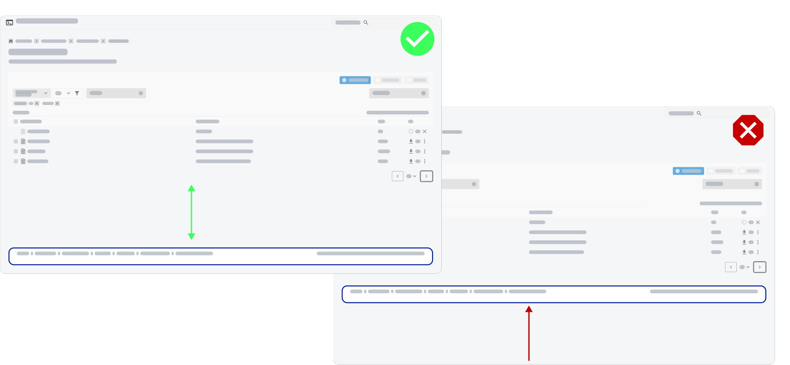
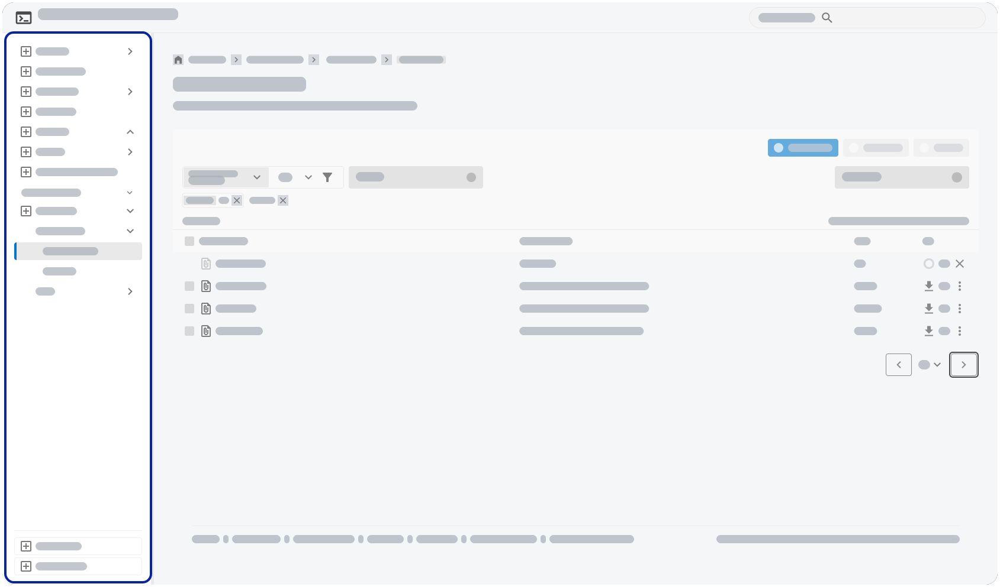

[← Back to Contents Overview](0_contents.md)

# Layout Fundamentals

As a bare minimum, a Juno application will comprise of a page header, a main content area, and a page footer.

The page footer will always be at the bottom of the viewport as a minimum (i.e. if the page content requires less than viewport height), or at the very bottom of the content.

All but the most basic applications will require some means of navigation. As a standard rule, the top level navigation will be a side navigation left of the content area.

