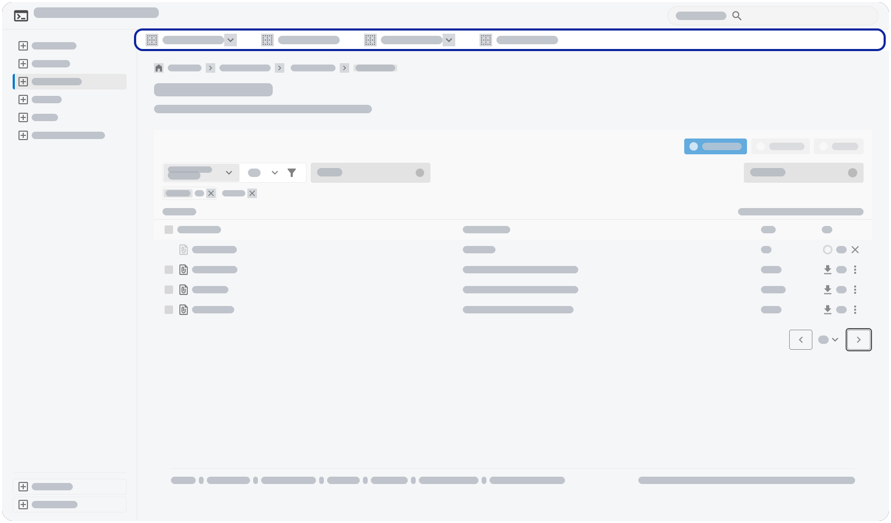
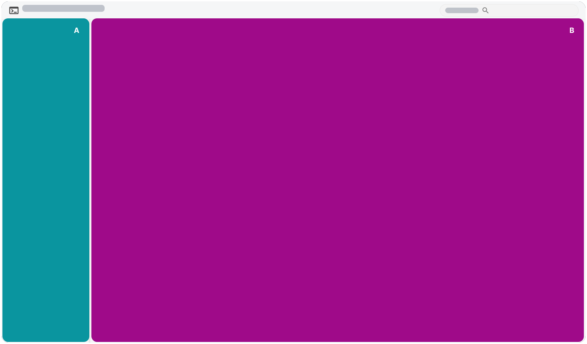

[← Back to Contents Overview](0_contents.md)

# Navigation Fundamentals

## Side Navigation as Top Level Navigation

Juno applications will use a side navigation as their top level navigation, with only very few and rare exceptions for legacy applications. A side navigation may be flat with no sub-levels for apps with a simpler structure. For applications with a more complex or deeper navigational structure, the Juno side navigation can contain entries with child elements, or host groups of elements with or without a title. In general, we do not recommended to use more than three levels.

## Alternative Second-Level Navigations

In cases where using a second or third level in the Juno SideNavigation is not feasible, a second-level top navigation above the content, that visibly is a child of the currently selected top level navigation entry, may be used.

## Switching Between Embedded Apps

In order to switch between embedded applications, even if not a "navigation" in the strict, technical sense of the term, we allow for using a navigation-like element `A`, as switching between applications `B` in such a scenario will be indistinguishable from an actual navigation for a user.

